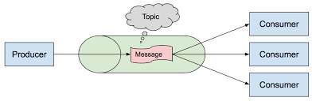

# TODO 2021

- 增加cellranger3.0 cell calling 方法 :white_check_mark:

- Single-cell mutation分析，类似于[10X Vartrix](https://github.com/10XGenomics/vartrix) :white_check_mark:

- 增加UMI Consensus模块 :white_check_mark:

- Demultiplex模块优化
    - 多个fastq文件从文件流读入，不需要合并在一起 :white_check_mark:
    
    - Rust改写以提高速度 :white_check_mark:

    - 修复不识别多余1个mismatch的问题 :white_check_mark:
    
    - 支持多线程 :black_square_button:

---

# TODO 2022

| 计划 | 难度 |
|  - | - |
|Demultiplex 支持并行 | :star: :star: :star: :star:  |
|将cutadapt的部分功能合并入Demultiplex模块 | :star: :star: :star:| 
|featureCounts模块改写|:star: :star: :star: :star: :star:|
|采用Snakemake或者Cromwell进行CeleScope流程控制|:star: :star: :star: :star: |
|CeleScope软件质量提高|:star: :star: :star: :star: :star:|

---

## Demultiplex 支持并行

**动机** 

提高多进程下的运行速度

**挑战**

实现一个正确的并行程序并不是一件容易的事情

**实现**

- 生产者-消费者模型


- 每个进程单独写入硬盘，全部进程结束后再合并，避免复杂的写入锁问题


---


- 生产者-消费者模型



---

## 将cutadapt的部分功能合并入Demultiplex

**动机** 

减少了一次fastq 的写和读，减少了IO，提高速度

```
barcode -> fastq -> cutadapt -> fastq -> STAR mapping -> ...

demultiplexing -> fastq -> STAR mapping -> ...
```

**挑战**
- 读懂cutadapt源码，在此基础上根据需要改进

---

## cutadapt比对算法
该算法是基于半全局对准（semiglobal alignment）。在全局比对中，两个序列从头到尾进行比较，并计算在该长度上发生的所有差异。在半全局比对中，允许序列相对于彼此自由移动，差异仅在它们之间的重叠区域受到惩罚：
```
   FANTASTIC
ELEFANT
```
前缀ELE和后缀ASTIC在各自的另一行中没有对应项，但这不算作错误。
不匹配、插入和删除都被算作一个错误，为算法指定一个参数（最大错误率）以描述可接受的错误数量。

---
## featureCounts模块改写

**动机** 
- featureCounts之后需要在输出的bam文件上加上4个tag，从而与cellranger输出的bam一致。这一步需要重新读写一次bam，增加了运行时间。（~ 2h / 22h)

**挑战**
- 编写一个类似featureCounts的高效程序比较困难。

---

## 采用Snakemake(Cromwell)进行CeleScope流程控制

**动机**
- 目前在HPC的流程控制使用SJM(Simple Job Manager)，已经停止开发维护，对AWS没有支持
- 目前在AWS的RNA-Seq流程控制使用Cromwell, 其他流程还没有编写流程
- 统一HPC和AWS使用的流程控制工具，可以避免编写两次，易于维护

**挑战**
- 需要与项目组同事深入合作，替换现有的SJM工具
- 了解选取的工具，详细阅读文档并进行测试


---

## CeleScope软件质量提高

**动机**
提高软件的外部和内部特征
- 外部质量：
    - 正确性：整个软件是否能正确工作
    - 可用性：用户学会和使用软件的难易程度
    - 效率：对系统资源的利用情况，包括存储，内存和执行时间等
- 内部质量：
    - 可维护性，


---
## CeleScope软件质量提高

**实现**

- 提高用户文档的详细程度

---

# 


